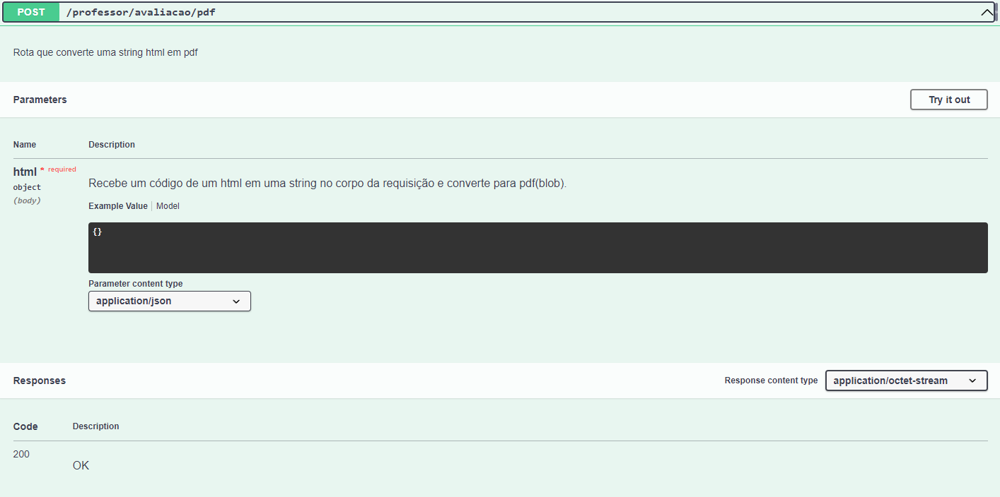
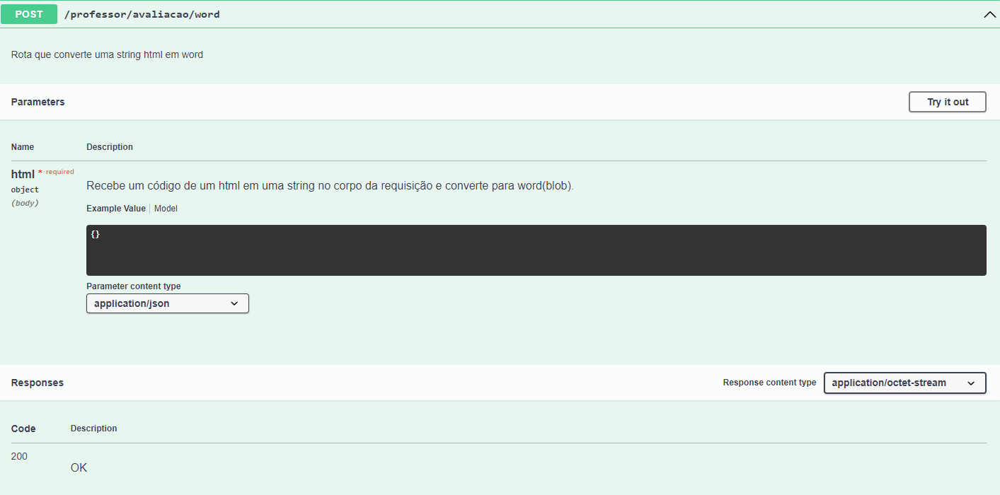

<h1>API NodeJs</h1>
<h4>API desenvolvida com node que é um wrapper de outras apis para para conversão de um html em pdf e word</h4>
<h2>Tecnologias Utilizadas</h2>

  
 

<h2>Rodando a API</h2>

Para rodar a api voce precisar ter instalado em sua maquina o git (https://git-scm.com/downloads) e o node (https://nodejs.org/en/download/) 

Após ter baixado o projeto com o 'git clone' , iniciar o servidor com o comando 'npm run start:dev' que iniciará o servidor em modo de desenvolvimento

<h2>Documentação</h2>

A documentação foi feita com swagger junto com swagger-autogen (acessar em '/docs')

